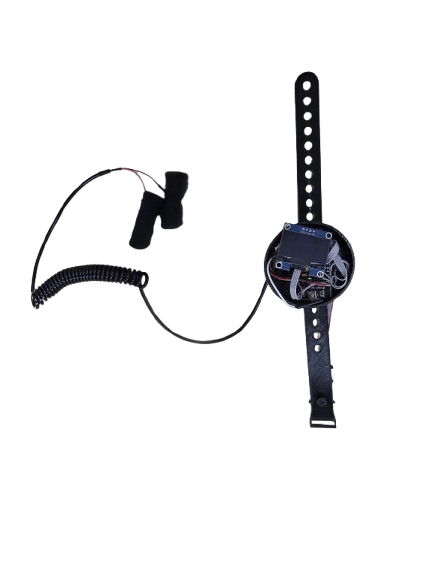
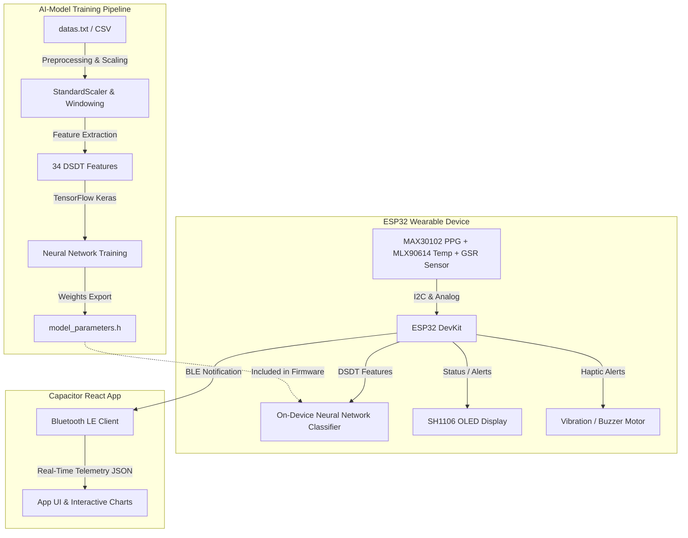

# Hydrocheck - Predictive Dehydration & Heat Stress Monitor

Hydrocheck is an end-to-end wearable solution designed for real-time dehydration and heat stress monitoring. It integrates multiple biological sensors, runs on-device TinyML machine learning, and streams live telemetry to a companion mobile application over Bluetooth Low Energy (BLE).

<p align="center">
  
  <br>
  <sub><b>Hydrocheck Hardware Wearable Prototype (ESP32, OLED Display & Biosensors)</b></sub>
</p>

---

## System Architecture



---

## Project Structure

*   [AI-Model](./AI-Model): Machine learning models, feature extraction pipelines, data preprocess tools, and training scripts.
*   [Hydrocheck-ESP32-Code](./Hydrocheck-ESP32-Code): C++ firmware project containing raw reading loops, BLE GATT configuration, calibration, and native neural network execution.
*   [Hydrocheck-app](./Hydrocheck-app): React Vite Capacitor app source code to monitor sensor states, plot graphs, and view system logs.
*   [Hydrocheck.apk](./Hydrocheck.apk): Built binary ready for installation on Android devices.

---

## 1. AI & Machine Learning Pipeline (`AI-Model`)

The machine learning pipeline processes time-series data using sliding windows to extract high-dimensional statistics before feeding it to a classification network.

### Data Flow & Feature Engineering
1.  **Dataset Preparation (`csv-transformer.py`):** Converts space-delimited text logs into a structured CSV format (`hydrocheck_dataset.csv`).
2.  **Data Cleaning & Scaling (`preprocessing.py`):**
    *   Targets 6 physiological signals: `GSR` (Galvanic Skin Response), `dGSR` (GSR first-order difference), `BPM` (Heart Rate), `HRV` (Heart Rate Variability), `SkinT` (Skin Temperature), and `Strain` (Heat Strain Score).
    *   Normalizes features using `StandardScaler` (saved to `scaler.pkl`).
    *   Slices data using a sliding window of size **10** (representing 60 seconds of telemetry).
3.  **DSDT Feature Extraction (`dsdt_features.py`):**
    *   Generates **34 features** per window including statistical metrics (mean, std dev, min, max, slope, trapezoidal area, skewness, kurtosis) and correlation coefficients (GSR vs BPM, GSR vs HRV, GSR vs SkinT, HRV vs BPM).

### Model Architecture & Training (`train_model.py`)
*   **Structure:** Dense Layer (64, ReLU) -> Dropout (0.3) -> Dense Layer (32, ReLU) -> Dropout (0.2) -> Dense Layer (16, ReLU) -> Dense Layer (2, Softmax).
*   **Classes:** `0` (Low Risk) and `1` (Moderate/High Risk).

### Exporting (`convert_tflite.py`)
*   Converts the Keras model to FLOAT32 and quantized INT8 TFLite formats.
*   The raw weights/biases are output as C-arrays in `model_parameters.h`.

---

## 2. Firmware & Edge Inference (`Hydrocheck-ESP32-Code`)

The device runs on an ESP32 micro-controller and handles reading acquisition, calibration, filtering, and local neural network computation.

### Firmware Design (`hydrocheck_ml.ino`)
*   **Sensor Multiplexing:** Selects active channels on the TCA9548A multiplexer to sample MLX90614 (Gy-906 Temp) and MAX30102 (PPG).
*   **Signal Processing:** Applies a Kalman Filter on the analog GSR readings to smooth high-frequency noise.
*   **Calibration:** Automatically runs for 15 seconds after booting up to record baseline body variables.
*   **Actuators:** Drives OLED display pages and triggers the Buzzer/Vibrator on risk classification changes.

### Edge Inference (`ml_inference.cpp` / `ml_inference.h`)
*   Contains a custom, zero-dependency C++ forward pass of the Keras classifier.
*   Collects normalized readings, computes 34 DSDT features natively, and runs dense layer matrix multiplications with stable Softmax evaluation.

---

## 📱 3. Mobile Companion App (`Hydrocheck-app`)

A responsive single-page web app built on React and Vite, compiled into an APK with Capacitor.

*   **BLE Client (`App.jsx`):** Discovers and connects to the Hydrocheck ESP32 BLE GATT Server. Subscribes to the target characteristic value notifications.
*   **Visualizations:** Draws a smooth heart rate timeline using a canvas component (`BpmChart`).
*   **Diagnostic Logs:** Displays incoming packets, parsing metrics, and status warnings in a built-in interactive console panel.

---

## Setup & Installation

### AI Model Pipeline
```bash
cd AI-Model
pip install numpy scipy pandas scikit-learn tensorflow matplotlib joblib
python csv-transformer.py
python preprocessing.py
python dsdt_features.py
python train_model.py
python convert_tflite.py
```

### Firmware Programming
1. Launch Arduino IDE.
2. Open `Hydrocheck-ESP32-Code/hydrocheck/hydrocheck_ml.ino`.
3. Install the required libraries (SparkFun MAX3010x, Adafruit MLX90614, Adafruit SH110X, Adafruit GFX).
4. Connect the ESP32 and select the port. Click **Upload**.

### Mobile App Development
```bash
cd Hydrocheck-app
npm install
npm run dev           # For web preview
npm run build         # Build production build
npx cap sync android  # Sync to Android project
```
